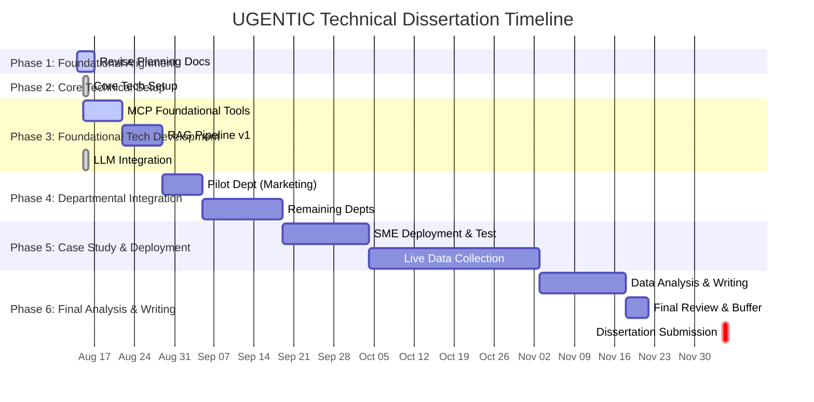

# TIMELINE - Project Schedule (v2)

**Version:** 2.0 (Revolutionary Integration Update)
**Due Date:** December 5, 2025

---

## 🗓️ **PROJECT PHASES (v2)**

### **Phase 1: Foundational Alignment (August 14 - August 16)**
*   **Focus:** Overhaul all planning documents to align with the new technical vision.
*   **Status:** ⏳ **In Progress**

### **Phase 2: Core Technical Setup (August 15 - August 15)**
*   **Focus:** Establish the project's code environment and initial file scaffolding.
*   **Status:** ✅ **Completed**

### **Phase 3: Foundational Tech Development (August 15 - September 9)**
*   **Focus:** Build and test the core MCP tools and the RAG pipeline.
*   **Status:** ⏳ **In Progress** (This now includes LLM integration)

### **Phase 4: Departmental Integration (September 10 - September 30)**
*   **Focus:** Integrate the core technology into the departmental agents, one by one.
*   **Status:** 🎯 **Upcoming**

### **Phase 5: Case Study & Deployment (October 1 - November 15)**
*   **Focus:** Deploy the system in the partner SME and conduct the research.
*   **Status:** 🎯 **Upcoming**

### **Phase 6: Final Analysis & Writing (November 16 - December 5)**
*   **Focus:** Analyze data, write the dissertation, and submit.
*   **Status:** 🎯 **Upcoming**

---

##  Gantt Chart (v2)

---

## ❗ **CRITICAL DEADLINES**

| Priority   | Date          | Item                    | Notes                               |
|------------|---------------|-------------------------|-------------------------------------|
| **‼️ CRITICAL** | **2025-09-05**  | Research Proposal Due   | Must be updated with new tech plan. |
| **‼️ CRITICAL** | **2025-12-05**  | Final Dissertation Due  | **PROJECT END DATE.**               |
| **High**     | 2025-09-09    | Foundational Tech Done  | Unlocks agent development.          |
| **High**     | 2025-09-30    | Full System Integration | Prerequisite for the case study.    |
| **High**     | 2025-11-15    | Data Collection Complete| Need sufficient time for analysis.  |

---
